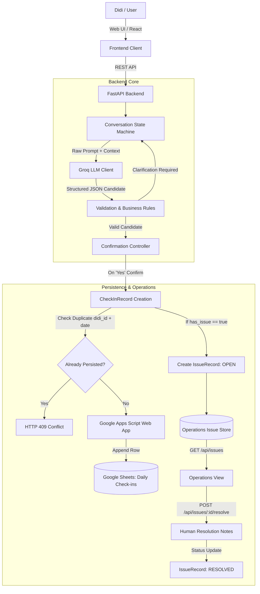

# FarmDidi Daily Production Check-in

FarmDidi works with rural women entrepreneurs ("Didis") who produce authentic food products such as artisanal pickles (achar). This MVP automates their daily production check-in: a Didi can respond naturally in Hindi, Hinglish, or English, and the system extracts structured production and operational issue information, validates the details with deterministic business rules, requests confirmation, and appends confirmed records to Google Sheets. Operational issues are automatically routed to a dedicated operations view where team members can inspect and resolve them.

---

## The Problem

Every morning, FarmDidi needs clear operational visibility across its decentralized network of Didis:
- **What is each Didi producing today?** (e.g., Mango Achar, Lemon Achar)
- **How much is being produced?** (exact quantity and unit, e.g., 15 kg)
- **Are there operational blockers or resource requirements?** (e.g., raw material shortage, jar/packaging shortages, equipment breakdowns)

Rural producers communicate naturally in conversational Hindi or Hinglish (e.g., *"Aaj 15 kg nimbu achar banaya, mirchi kam pad gayi"*). Standard form-based web portals fail because they impose rigid schema constraints and unfamiliar form interfaces. Conversely, relying on manual phone calls or unparsed messaging chat threads creates operational blind spots, delays in resolving material shortages, and inconsistent record-keeping.

---

## The Solution

This MVP provides an AI-assisted, rule-governed check-in system:
1. **Conversational Interface**: A lightweight web interface where Didis engage in a natural conversation.
2. **LLM Extraction**: Groq (running `qwen/qwen3.6-27b`) interprets informal Hindi/Hinglish/English and extracts candidate JSON structures.
3. **Deterministic Python Validation**: Python business rules enforce data integrity (catalog matching, numeric bounds, missing attribute detection, and ambiguity flags). The LLM is never allowed to dictate application state or write records.
4. **Explicit Didi Confirmation & Corrections**: The Didi confirms a human-readable summary before anything is persisted. If anything is wrong, a single correction turn parses updates before re-confirming.
5. **Auditable Persistence**: Confirmed check-ins are saved via Google Apps Script to Google Sheets.
6. **Separate Operations Issue Lifecycle**: Any reported operational issue generates an open `IssueRecord` in an operations dashboard for human review and resolution.

---

## End-to-End User Journey

```text
Daily Check-in
      │
      ▼
Didi selected / session started
      │
      ▼
AI asks what she is making
      │
      ▼
Didi responds naturally
      │
      ▼
Groq extracts structured production data
      │
      ▼
Python validates the extraction
      │
Missing / ambiguous information?
      ├── Yes ──► Ask clarification & accumulate turn
      └── No
             │
             ▼
AI asks about issues / requirements
             │
             ▼
Didi reports issue or states "no issue"
             │
             ▼
Groq extracts structured issue data
             │
             ▼
Python validates issue
             │
             ▼
Confirmation summary presented
             │
Didi confirms?
      ├── No ──► Correction flow
      │               │
      │          Corrected candidate parsed & validated
      │               │
      │          Updated confirmation summary
      │
      └── Yes
             │
             ▼
       CheckInRecord created
             │
             ├──► Appended to Google Sheets (Immutable)
             │
             └──► If issue exists:
                         │
                         ▼
                   IssueRecord (status = "open")
                         │
                         ▼
                   Operations View
                         │
                         ▼
                   Human resolves issue
                         │
                         ▼
                   IssueRecord (status = "resolved")
```

### Step-by-Step Breakdown

1. **Session Initiation**: The Didi is identified by her ID (`D001`, `D002`, etc.) from the authorized catalog.
2. **Production Inquiry**: The assistant greets her by name in Hindi/Hinglish and asks what she is preparing today.
3. **Natural Language Input & Extraction**: The Didi answers in conversational phrasing (e.g., *"Aaj 15 kg nimbu achar banaya"*). Groq extracts the candidate product, quantity, unit, and production status.
4. **Validation & Clarification**: Python validates the candidate against the product catalog and allowable unit ranges. If the quantity is missing or ambiguous (e.g., *"20 ya 30 kilo"*), the system asks for clarification without advancing.
5. **Issue Inquiry**: Once production is validated, the assistant asks whether she is facing any difficulty or requires materials.
6. **Issue Parsing**: The Didi replies with a problem (*"Mirchi kam pad gayi hai"*) or indicates smooth operations (*"Koi dikkat nahi hai"*).
7. **Confirmation Summary**: A clear summary card is presented showing the extracted details. The Didi can click **"Yes, correct"** or **"No, make correction"**.
8. **Correction Loop**: If she chooses to correct, she can specify what changed (e.g., *"Quantity 20 kg hai"*). The update is merged, validated, and re-summarized.
9. **Persistence & Operations**: Upon confirmation:
   - A `CheckInRecord` is created and appended to Google Sheets.
   - If an issue was flagged, a distinct `IssueRecord` is registered with `status="open"`.
   - Operations personnel can review the issue and manually resolve it with resolution notes.

### Example Real-World Interaction

```text
System:
"Namaste Sunita ji! Aaj aap kya banane ka plan kar rahi hain aur kitna?"

Didi:
"Aaj 15 kg nimbu achar banaya."

System:
"Bahut badhiya! Kya kaam mein koi dikkat aa rahi hai ya kisi cheez ki zarurat hai?"

Didi:
"Mirchi kam pad gayi hai."

System:
"Main confirm kar lu: 15.0 kg Lemon Achar aur Mirchi shortage. Ye sahi hai?"
[Yes, correct]  [No, make correction]

Didi:
(Clicks "Yes, correct")

System:
"Dhanyawad Sunita ji! Aapka aaj ka check-in confirm ho gaya hai."
```

**What gets stored:**
- **Google Sheet Row (`Daily Check-ins`)**:
  `[2026-09-10, D002, Sunita, planned, Lemon Achar, 15, kg, TRUE, raw_material, Mirchi kam pad gayi hai, Mirchi shortage, confirmed]`
- **In-Memory Operations Issue (`ISS-20260910-D002`)**:
  `{ issue_id: "ISS-20260910-D002", didi_id: "D002", didi_name: "Sunita", issue_type: "raw_material", issue: "Mirchi kam pad gayi hai", status: "open" }`

---

## Architectural Principle: LLM vs. Python Responsibilities

A foundational design decision in this project is strict separation of concerns: **The LLM never controls application state, persistence, or business logic.**

| Capability | Groq / LLM | Python Backend |
| :--- | :--- | :--- |
| **Natural Language Understanding** | Multi-lingual parsing (Hindi, Hinglish, English) | None (consumes structured outputs) |
| **Information Extraction** | Normalizes colloquialisms into candidate JSON | Validates JSON against typed Pydantic models |
| **State Machine** | None | Controls conversation state transitions |
| **Business Rules & Limits** | None | Enforces catalog existence, positive quantities, unit conversions |
| **Clarification Logic** | None | Decides when data is insufficient and triggers clarification prompts |
| **Confirmation Gate** | None | Requires explicit human confirmation before persisting |
| **Deduplication** | None | Rejects duplicate same-day check-ins (`HTTP 409`) |
| **Persistence** | None | Handles HTTP calls to Google Apps Script / Google Sheets |
| **Issue Lifecycle** | None | Manages `open` -> `resolved` transitions and human notes |

> **Key Rule**: When the LLM output is ambiguous, low confidence, or incomplete, the Python backend intercepts the response and asks a targeted follow-up question instead of guessing.

---

## Architecture Diagram



---

## Data Models

The system maintains two distinct records to preserve historical fidelity while accommodating operational mutability.

### 1. CheckInRecord (Historical Immutable Snapshot)

Written **once** upon confirmation. Never mutated afterwards.

| Field | Type | Description |
| :--- | :--- | :--- |
| `date` | `string` | ISO calendar date (`YYYY-MM-DD`) |
| `didi_id` | `string` | Unique identifier (`D001`, `D002`, etc.) |
| `didi_name` | `string` | Full name of the producer |
| `production_status` | `string` | `planned`, `in_progress`, `completed`, or `none` |
| `product` | `string?` | Canonical product name from catalog |
| `quantity` | `float?` | Numerical production volume |
| `unit` | `string?` | Standard unit (`kg`, `bottles`, `units`) |
| `has_issue` | `boolean` | `true` if an issue was reported; otherwise `false` |
| `issue_type` | `string?` | Categorized issue domain (`raw_material`, `packaging`, etc.) |
| `issue` | `string?` | Short issue summary |
| `issue_details` | `string?` | Additional context or notes |
| `status` | `string` | Always `"confirmed"` upon creation |

### 2. IssueRecord (Operational Mutable Lifecycle)

Created only when `has_issue == true`. Tracks real-world resolution.

| Field | Type | Description |
| :--- | :--- | :--- |
| `issue_id` | `string` | Unique identifier (e.g., `ISS-20260910-D002`) |
| `date` | `string` | ISO calendar date (`YYYY-MM-DD`) |
| `didi_id` | `string` | Reporting Didi identifier |
| `didi_name` | `string` | Reporting Didi name |
| `issue_type` | `string` | Categorization domain |
| `issue` | `string` | Description of problem |
| `issue_details` | `string?` | Extended details |
| `status` | `string` | `"open"` or `"resolved"` |
| `resolved_at` | `string?` | ISO timestamp of resolution |
| `resolution_notes` | `string?` | Human operator resolution notes |

---

## Reliability & Edge Cases

The system enforces defensive guards against real-world conversational uncertainty:

- **Unknown Didi Identification**: Rejects unknown IDs with `HTTP 404` and prevents session generation.
- **Missing Quantity / Product**: If a Didi says *"Aaj achar banaya"* without quantity, the engine stays in `ASK_PRODUCTION`, stores the partial product match, and asks: *"Quantity kitni hai? Please quantity batayein."* Multi-turn inputs accumulate cleanly.
- **Ambiguous Quantities**: Ranges like *"20 ya 30 kilo"* are rejected by the extraction rules (`quantity=None`), prompting the Didi for a specific figure.
- **Invalid Quantities**: Negative numbers, zeroes, or non-numeric entries are flagged as invalid.
- **Explicit "No Production"**: Phrases like *"Aaj tabiyat kharab hai, kuch nahi bana rahi"* transition `production_status` to `none` without demanding quantity.
- **Explicit "No Issue"**: Clarifications such as *"Sab theek hai, koi problem nahi"* set `has_issue = false` and advance directly to confirmation without opening an issue.
- **Pre-Confirmation Corrections**: The Didi can modify quantities or products prior to saving. No-op corrections (*"sorry kuch nahi"*) gracefully revert back to confirmation.
- **Same-Day Duplicate Check-ins**: Enforces strict single-check-in constraints per Didi per day (`HTTP 409 Conflict`).
- **External Sheet Failure Recovery**: If Google Sheets connectivity fails during save, the backend marks `sheet_saved = false`, keeps the session recorded, and returns a friendly retry message.
- **Idempotent / Repeated Issue Resolution**: Resolving an already resolved issue is blocked with `HTTP 400`.
- **Unknown Issue Lookup**: Resolving a non-existent issue ID yields `HTTP 404`.

---

## Daily Deduplication Safeguard

To maintain clean operational reporting, the business rule mandates:
```text
One confirmed Daily Check-in per Didi per calendar date
```

- When confirmation is received (`decision == "yes"`), Python checks `(session.didi_id, date.today().isoformat())` against `_persisted_daily_records`.
- If an entry already exists, the server raises `HTTP 409 Conflict`:
  ```json
  {
    "detail": "A daily check-in for Sunita (D002) on 2026-09-10 has already been confirmed and recorded."
  }
  ```
- No duplicate Google Sheet row is created, and no secondary issue ticket is opened.
- The web UI gracefully catches `409`, displays an explanatory Hindi message, disables confirmation controls, and presents a **"Start Another Check-in"** option.
- *Note*: In this MVP phase, deduplication tracking is held in-memory in the backend service layer.

---

## Operations Workflow

The operations dashboard decouples production logging from operational firefighting:

```text
Didi reports issue
        │
        ▼
IssueRecord created (status = "open")
        │
        ▼
Operations team sees ticket on Dashboard
        │
        ▼
Human takes action (arranges chili, orders jars, etc.)
        │
        ▼
Human enters notes and clicks "Resolve Issue"
        │
        ▼
IssueRecord updated (status = "resolved", resolved_at = timestamp)
```

**Key Principle**: AI extracts and flags the problem; only a **human team member** can verify and mark a physical operational issue as resolved.

---

## Google Sheets Integration

The system persists check-ins to Google Sheets via a dedicated Google Apps Script Web App:

- **12-Column Schema**:
  1. `Date`
  2. `Didi ID`
  3. `Didi Name`
  4. `Production Status`
  5. `Product`
  6. `Quantity`
  7. `Unit`
  8. `Has Issue`
  9. `Issue Type`
  10. `Issue`
  11. `Issue Details`
  12. `Status`
- **Confirmation Guarantee**: Rows are appended **only** after explicit Didi confirmation.
- **Lightweight Architecture**: No complex Google Cloud IAM service-account credentials required on the local machine; the backend communicates via HTTPS POST directly to the Apps Script endpoint.

---

## Project Structure

```text
farmdidi/
├── .env.example                     # Environment configuration template
├── .gitignore                       # Git ignore rules for secrets and build artifacts
├── CODEBASE_ANALYSIS.md             # Codebase architecture and phase analysis
├── README.md                        # Primary project documentation
├── requirements.txt                 # Backend Python dependencies
│
├── backend/
│   ├── __init__.py
│   ├── config.py                    # Environment settings and defaults
│   ├── main.py                      # FastAPI application, routing, and lifecycle
│   ├── models.py                    # Pydantic data schemas (CheckInRecord, IssueRecord, etc.)
│   ├── google_sheets.md             # Google Sheets design & schema documentation
│   ├── issue_management.md          # Issue lifecycle specifications
│   ├── validation_rules.md          # Business validation rules reference
│   ├── test_daily_deduplication.py  # Deduplication unit tests (7 cases)
│   ├── test_failure_behavior.py     # End-to-end failure suite (11 cases)
│   ├── test_production_cases.py     # Production language extraction tests (8 cases)
│   │
│   ├── data/
│   │   ├── didis.json               # Seed catalog of authorized Didis
│   │   └── products.json            # Seed catalog of products and allowed units
│   │
│   ├── google_apps_script/
│   │   └── Code.gs                  # Apps Script endpoint for Google Sheets
│   │
│   └── services/
│       ├── __init__.py
│       ├── ai.py                    # Prompt engineering & candidate JSON extractors
│       ├── conversation.py          # State machine (ConversationEngine & Session)
│       ├── google_sheets.py         # Google Apps Script HTTP persistence client
│       ├── groq_client.py           # Groq API client initialization
│       ├── issues.py                # In-memory Issue store and resolution handlers
│       └── validation.py            # Deterministic Python validation functions
│
└── frontend/
    ├── index.html                   # HTML entry point
    ├── package.json                 # Node dependencies and scripts
    ├── vite.config.js               # Vite bundler configuration
    ├── .oxlintrc.json               # Oxlint configuration
    │
    └── src/
        ├── main.jsx                 # React root mount
        ├── App.jsx                  # Main interface container & tab switching
        ├── components/
        │   ├── ChatInput.jsx        # Conversational text input
        │   ├── ChatMessage.jsx      # Individual message bubble component
        │   ├── ChatWindow.jsx       # Scroll-anchored conversation stream
        │   └── OperationsView.jsx   # Operations dashboard for issue management
        └── styles/
            └── index.css            # Scoped styles and responsive layout
```

---

## Local Setup

### Prerequisites
- Python 3.10+
- Node.js 18+ and npm
- Groq Cloud API Key

### 1. Backend Setup

```bash
# Navigate to repository root
cd farmdidi

# Create and activate Python virtual environment
python -m venv .venv

# On Windows (PowerShell):
.\.venv\Scripts\Activate.ps1
# On Linux/macOS:
# source .venv/bin/activate

# Install dependencies
pip install -r requirements.txt

# Create environment configuration
copy .env.example .env
```

Edit `.env` to supply your credentials:
```ini
GROQ_API_KEY=gsk_your_actual_groq_api_key
GROQ_MODEL=qwen/qwen3.6-27b
GOOGLE_APPS_SCRIPT_URL=https://script.google.com/macros/s/your_deployment_id/exec
```

Start the backend server:
```bash
uvicorn backend.main:app --reload --host 127.0.0.1 --port 8000
```

### 2. Frontend Setup

```bash
# From repository root, navigate to frontend
cd frontend

# Install packages
npm install

# Start Vite development server
npm run dev
```

The frontend will be accessible at: `http://localhost:5173/`

---

## Environment Variables

| Variable | Required | Default | Description |
| :--- | :--- | :--- | :--- |
| `GROQ_API_KEY` | **Yes** | — | Groq Cloud API key for multilingual extraction |
| `GROQ_MODEL` | No | `qwen/qwen3.6-27b` | LLM model identifier on Groq |
| `GOOGLE_APPS_SCRIPT_URL`| **Yes** | — | Web app URL of deployed Google Apps Script |
| `HOST` | No | `127.0.0.1` | Host address for FastAPI server |
| `PORT` | No | `8000` | Port for FastAPI server |
| `APP_NAME` | No | `FarmDidi Daily Production Check-in` | Application display name |
| `APP_ENV` | No | `development` | Environment mode (`development` / `production`) |

---

## API Overview

### Health & Diagnostics
- **`GET /`**: Service banner and status.
- **`GET /health`**: Healthcheck endpoint returning `{"status": "ok"}`.
- **`GET /api/sheets/test`**: Verifies bidirectional connectivity to Google Apps Script.
- **`POST /api/sheets/test-write`**: Executes a controlled diagnostic write to Google Sheets.

### Check-in Conversation Engine
- **`POST /api/checkin/start`**
  - *Payload*: `{"session_id": "string", "didi_id": "D001"}`
  - *Purpose*: Initiates check-in for an authorized Didi and returns greeting.
- **`POST /api/checkin/production`**
  - *Payload*: `{"session_id": "string", "message": "Aaj 15 kg nimbu achar banaya"}`
  - *Purpose*: Extracts production details via Groq, validates, and asks for issues.
- **`POST /api/checkin/issue`**
  - *Payload*: `{"session_id": "string", "message": "Mirchi kam pad gayi"}`
  - *Purpose*: Extracts issue details, validates, and generates confirmation card.
- **`POST /api/checkin/confirm`**
  - *Payload*: `{"session_id": "string", "decision": "yes" | "no"}`
  - *Purpose*: Enforces deduplication, saves to Google Sheets, and creates issue if applicable.
- **`POST /api/checkin/correct`**
  - *Payload*: `{"session_id": "string", "message": "Quantity 20 kg hai"}`
  - *Purpose*: Updates candidate record during correction phase and re-summarizes.

### Operations & Issues
- **`GET /api/issues`**: Retrieves list of all operational issues.
- **`GET /api/issues/{issue_id}`**: Retrieves detailed record for a specific issue.
- **`POST /api/issues/{issue_id}/resolve`**
  - *Payload*: `{"resolution_notes": "Arranged 5 kg green chillies"}`
  - *Purpose*: Transitions issue from `open` to `resolved` with timestamp and notes.

---

## Automated & End-to-End Verification

The MVP includes automated test suites covering core business logic, edge conditions, and frontend integrity:

| Test Suite | Scope | Result |
| :--- | :--- | :--- |
| **Edge / Failure Suite** (`test_failure_behavior.py`) | 11 critical edge cases (unknown Didi, ambiguous quantity, invalid bounds, no-op correction, 409 duplicate, sheet failure, etc.) | **11 / 11 PASSED** |
| **Deduplication Suite** (`test_daily_deduplication.py`) | 7 scenarios testing `(didi_id, date)` uniqueness, isolation, and HTTP 409 guards | **7 / 7 PASSED** |
| **Production Understanding** (`test_production_cases.py`)| 8 real multilingual inputs (Hindi words, digits, no-production, ambiguity) | **8 / 8 PASSED** |
| **Frontend Linting** (`oxlint`) | Code styling and syntax across all JSX/JS files | **0 errors, 0 warnings** |
| **Frontend Build** (`vite build`) | Production asset compilation | **PASS** |
| **Backend Compilation** (`compileall`) | Bytecode verification across all modules | **PASS** |
| **Google Sheets Connectivity** (`/api/sheets/test`) | Round-trip HTTPS request to Apps Script | **PASS** |
| **Browser E2E Verification** | Interactive journey: Check-in -> Sheet Append -> Operations -> Resolution -> 409 | **PASS** |

---

## 3–5 Minute Live Demonstration

To demonstrate the full capability of the MVP in 3–5 minutes:

1. **Start Check-in**:
   - Open `http://localhost:5173/`.
   - Select **Sunita (`D002`)** from the Didi selector and click **"Start Check-in"**.
2. **Submit Production**:
   - Type naturally: `"Aaj 15 kg nimbu achar banaya"` and press Send.
   - Observe the system acknowledging the 15 kg Lemon Achar and asking about difficulties.
3. **Report an Issue**:
   - Type: `"Mirchi kam pad gayi hai"` and press Send.
   - Observe the structured confirmation summary card with extracted product, quantity, and issue details.
4. **Confirm the Check-in**:
   - Click **"Yes, correct"**.
   - Observe confirmation message: *"Dhanyawad Sunita ji! Aapka aaj ka check-in confirm ho gaya hai."*
5. **Inspect Google Sheets**:
   - Open the linked Google Sheet to verify the new immutable row added under `Daily Check-ins`.
6. **Review & Resolve in Operations Dashboard**:
   - Click the **"Operations (Issues)"** tab in the web interface.
   - Observe the open ticket for Sunita with status badge **OPEN**.
   - Click on the issue, enter resolution note: `"Arranged 5 kg green chillies from local supplier"`, and click **"Resolve Issue"**.
   - Observe status update immediately to **RESOLVED** with timestamp.
7. **Demonstrate Same-Day Deduplication**:
   - Return to the **"Didi Check-in"** tab and start a new check-in for Sunita (`D002`).
   - Progress to the confirmation card and click **"Yes, correct"**.
   - Observe the clear **HTTP 409 duplicate rejection** notice preventing duplicate entries.

---

## Known Limitations

This implementation is an **MVP demonstration** designed to validate conversational check-in ergonomics and business rules:

- **In-Memory Volatility**: Check-in sessions, active issues, and daily deduplication caches are stored in backend memory; restarting the FastAPI server resets in-memory state.
- **Web Chat vs. Messaging**: Current interaction occurs over a responsive web client rather than native WhatsApp or SMS channels.
- **Seed Catalogs**: Didi profiles and product catalogs are loaded from local JSON files rather than an external database.
- **Ambiguous LLM Multi-turns**: While single-step clarifications and partial-merges are handled, highly erratic or contradictory conversational deviations can still require user re-prompting.
- **Authentication**: No role-based access control or Didi login authentication is implemented.

---

## Out of Scope

The following features were intentionally excluded to maintain a sharp focus on daily check-in reliability:
- Retrieval-Augmented Generation (RAG) / Vector Databases
- Autonomous multi-agent coordination
- Model fine-tuning
- Automated WhatsApp or SMS webhook integrations
- Multi-factor authentication / identity providers
- Full enterprise ticketing / SLA management systems
- Direct database drivers (PostgreSQL / MySQL)
- Autonomous AI-driven issue resolution

---

## Deployment Direction

When advancing from local demonstration to cloud staging:
- **Frontend**: Deploy static single-page application to **Vercel** with client-side environment pointing to backend URL.
- **Backend**: Deploy FastAPI service to **Render** as a web service.
- **Groq API**: Injected as a secure server-side environment variable on Render (`GROQ_API_KEY`).
- **Google Sheets**: Existing Google Apps Script deployment acts as a serverless bridge, insulated by URL configuration (`GOOGLE_APPS_SCRIPT_URL`).
